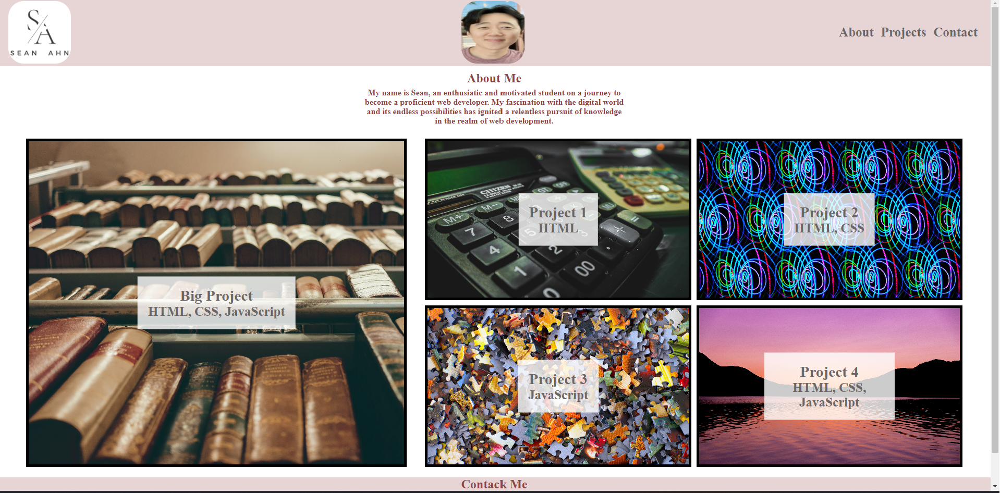

# seanahn_portfolio

## Description
This was a project where I created my portfolio for my potential employer.  In my portfolio, I want to show my deployed work samples so that I can be assessed whether I'm a good candidate for an open position.

Visit webpage here:
file:///C:/Users/edota/bootcamp/homework/seanahn_portfolio/index.html

## Screenshot

## Technologies Used:
This project utilized technologies commonly used in creating simple portfolio, which includes HTML and CSS.

## Challenges
Some of the challenges I encounter while working on this project were placement of images, header, footer, links, etc in order to make the portfolio stand out and appealing to the employer. 

## Successes
I was able to create appealing portfolio for myself that I can use for the potential employer.  I recognize that there is much room to improve this portfolio, but I am limited in this area because of limited ability.  However, I am looking forward to improve this portfolio as my skillset improves.
